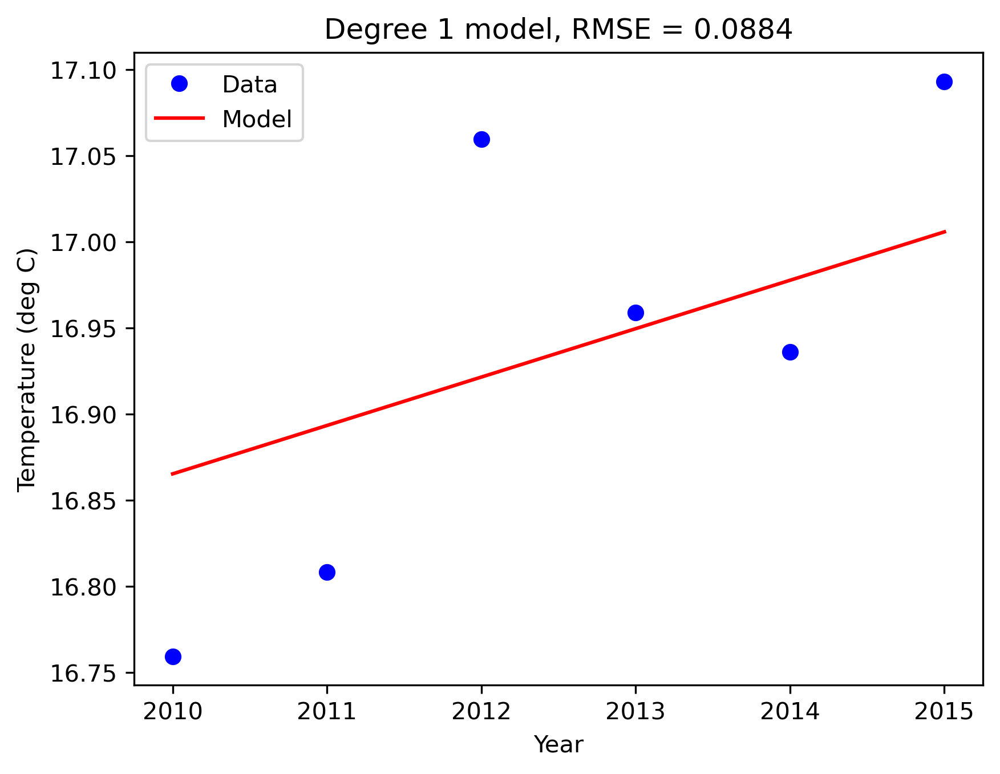

# Historical Temperature Trend Analysis

[中文说明](README.zh-CN.md)

A Python notebook that analyzes 421,848 daily temperature records from 21 cities over 1961–2015. It compares annual aggregation, five-year moving averages and polynomial regression, then evaluates models on later years.

The temperature dataset and two reused helper implementations are attributed to [MIT OCW temperature-analysis resources](https://ocw.mit.edu/courses/6-0002-introduction-to-computational-thinking-and-data-science-fall-2016/resources/ps5/). Attribution and reuse terms are in [provenance](docs/provenance.md) and [LICENSE](LICENSE).

## Results at a glance

Training uses 1961–2009. Testing uses 2010–2015. Both segments are smoothed separately with a trailing window of up to five years.

| Polynomial degree | Training R² | Test RMSE (°C) |
| --- | ---: | ---: |
| 1 | 0.9250 | 0.0884 |
| 2 | 0.9448 | 0.2118 |
| 20 | 0.9724 | 1.4912 |

The target is the smoothed annual mean of this fixed city cohort. The linear baseline has the lowest error in this six-year comparison. The degree-20 fit produces a conditioning warning; its higher training R² does not translate into lower test error.



## Read the project

- [Notebook](temperature_analysis.ipynb): all executable analysis and the original assertion checks.
- [Analysis](docs/analysis.md): experiment definitions, results, interpretation and proposed applications.
- [Data](docs/data.md): schema, coverage, source, checksum and known data issue.
- [Data and code sources](docs/provenance.md): external resources, implemented functions and reuse terms.
- [Figures](figures/): ten original result images with descriptive names. The linear training image also serves as the moving-average trend image.

## Run

Use Python 3.11. Install dependencies in a project environment:

```text
python -m venv .venv
```

Activate it with `.venv\Scripts\activate` on Windows, or `source .venv/bin/activate` on macOS/Linux, then:

```text
python -m pip install -r requirements.txt
```

Open `temperature_analysis.ipynb` in a notebook-capable IDE, select that environment, restart the kernel and run all cells in order. Keep `data.csv` in the project root. The code reads this relative filename, so the working directory must be the project root.

For headless execution from an environment with the `python3` kernel available:

```text
jupyter execute temperature_analysis.ipynb --kernel_name=python3 --timeout=120 --output=executed
```

This command creates a separate executed notebook. It does not overwrite the input notebook.

## Verification

On 2026-10-08, all 22 original code cells executed successfully in a fresh Python 3.11.14 kernel. The six existing assertion groups passed. R² and RMSE reproduced the displayed results to four decimal places. The degree-20 conditioning warning remained visible.

Stored notebook outputs and PNGs show the reported experimental results. Reproduction was verified through a full notebook rerun in an existing environment; a fresh dependency installation was not tested.

## Interpretation and reuse

The city average is equally weighted and is not a global or area-weighted national temperature estimate. Smoothing changes the target and introduces dependence. The variability statistic includes seasonality and is not an extreme-weather event count. See the analysis notes for the evaluation window and numerical limitations.

This project is shared under **CC BY-NC-SA 4.0**, following the upstream materials. It requires attribution, noncommercial use and share-alike redistribution. The noncommercial restriction means this is a public, source-available project rather than unrestricted open-source software. No institutional endorsement is implied.
