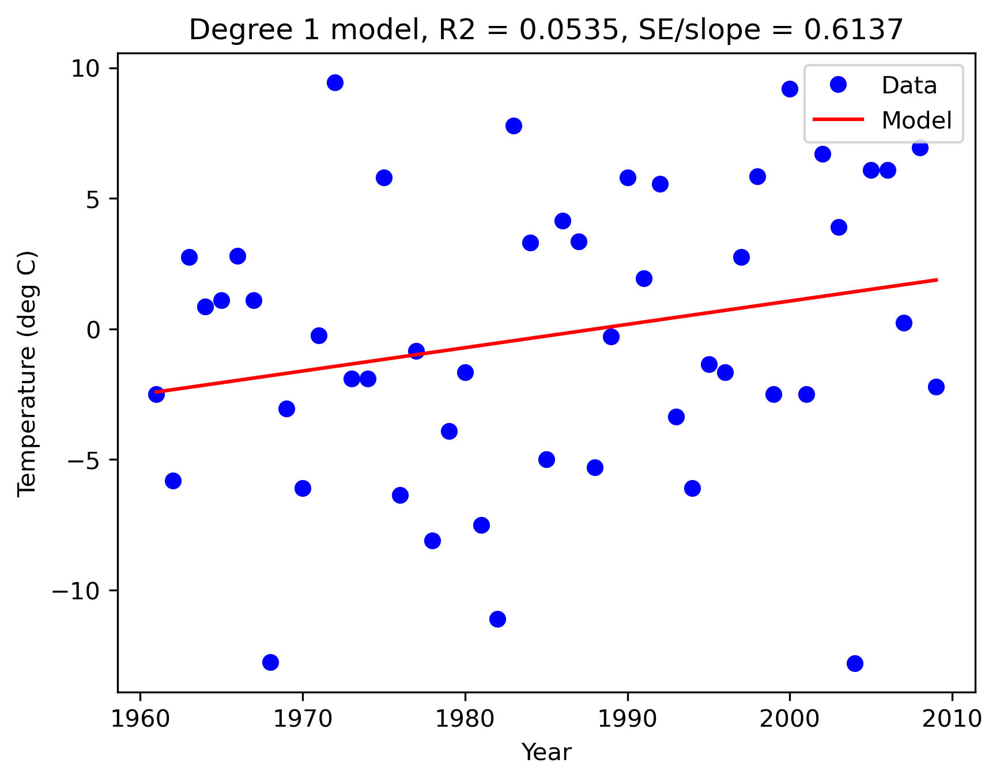
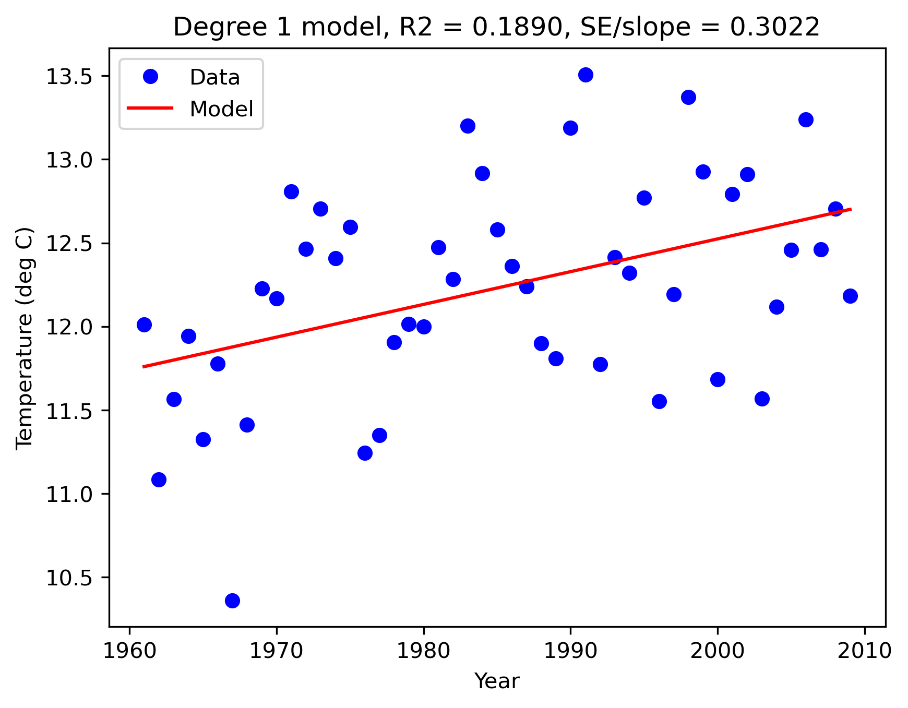
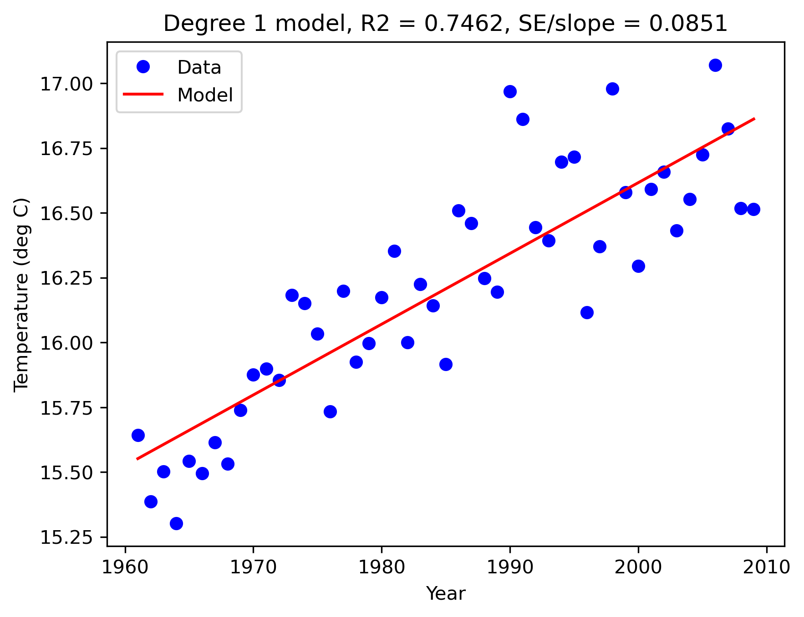
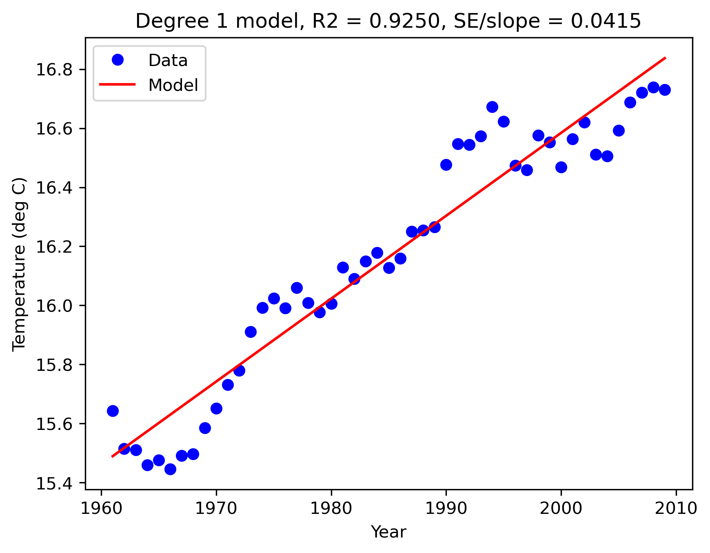
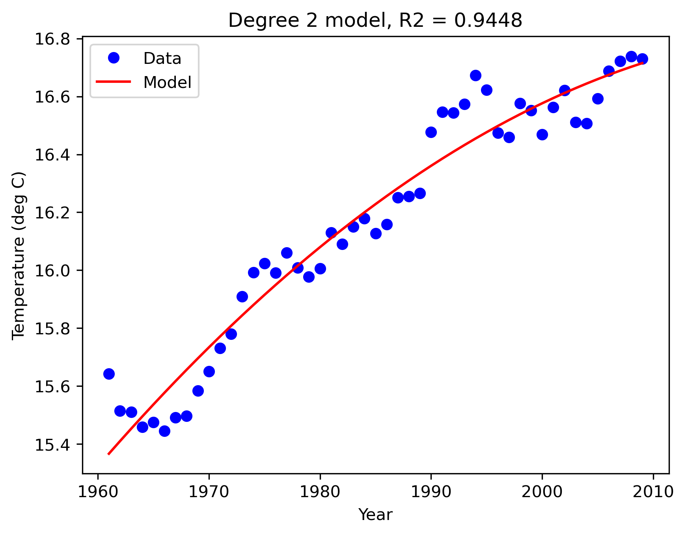
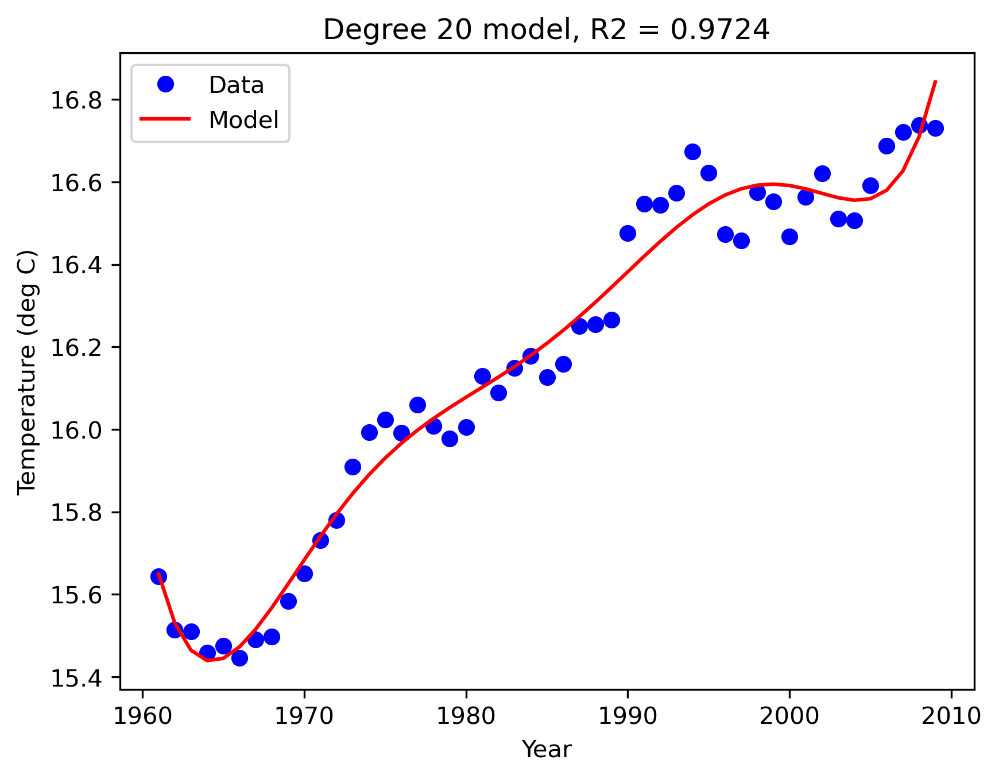
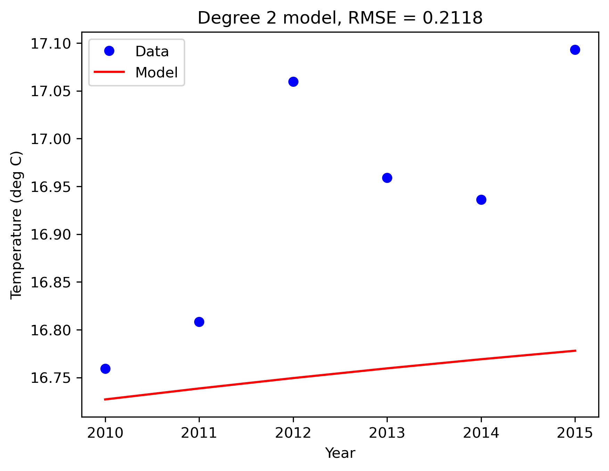
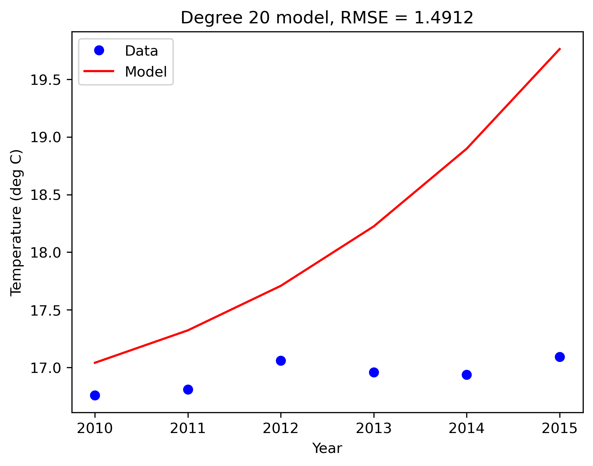
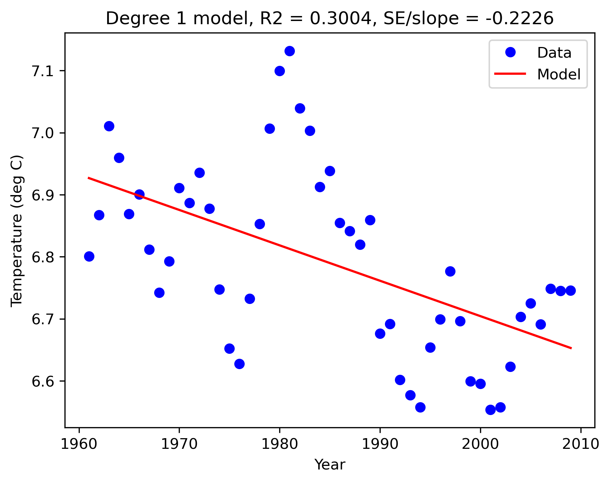

# Analysis and interpretation

## Experiment design

Daily temperature is first aggregated within a year or across cities. Regression uses calendar year as its sole predictor. The training interval contains 49 annual observations, 1961–2009. The test interval contains six annual observations, 2010–2015. No random split, neural network or deployed prediction service is implemented.

| Step | Transformation or comparison | Purpose |
| --- | --- | --- |
| 1 | New York January 10 versus annual means | Examine the influence of daily weather noise |
| 2 | Equally weighted means across 21 cities | Examine the effect of geographic aggregation |
| 3 | Trailing five-year moving average | Display slower-changing trends |
| 4 | Degrees 1, 2 and 20 on later years | Compare training fit and extrapolation error |
| 5 | Standard deviation of daily cross-city means | Describe variability within each year |

## Single-city and cohort trends

Original saved linear-fit results for 1961–2009:

| Target | Slope (°C/year) | R² | SE/slope |
| --- | ---: | ---: | ---: |
| New York, January 10 | 0.08936 | 0.0535 | 0.6137 |
| New York, annual mean | 0.01960 | 0.1890 | 0.3022 |
| Cohort, annual mean | 0.02731 | 0.7462 | 0.0851 |
| Cohort, smoothed annual mean | 0.02809 | 0.9250 | 0.0415 |

Annual aggregation produces a clearer trend than one fixed day in New York. Aggregating the cohort further reduces local fluctuations in this dataset. These are descriptive comparisons over different targets, not causal attribution of climate change.

`gen_cities_avg` averages each city's annual mean, assigning the same weight to every city. The preserved `national_*` variable names therefore denote a fixed 21-city cohort. They do not denote global temperatures or a spatially representative national estimate.

## Moving-average definition

For index i and positive window length w, the implementation averages observations from max(0, i-w+1) through i, including i. The first w-1 values use shorter windows. With w=5, the startup windows contain one, two, three and four observations.

Training and test segments are smoothed independently. For example, the test value for 2010 is its raw annual mean; the 2011 value averages 2010 and 2011. Test smoothing does not incorporate 2006–2009. A continuous window across the split would change the target and scores and is not the preserved experiment.

Smoothing suppresses fluctuations and introduces overlap between adjacent observations. The resulting increase in training R² describes a transformed target. It is not evidence of an equivalent increase in forecast accuracy. Overlap also limits a naive independent-observation interpretation of the SE/slope diagnostic.

## Model comparison

| Degree | Original training R² | Original test RMSE (°C) |
| --- | ---: | ---: |
| 1 | 0.9250 | 0.0884 |
| 2 | 0.9448 | 0.2118 |
| 20 | 0.9724 | 1.4912 |

All models use the same training observations and evaluate the same smoothed test target. The linear model has the lowest error in this comparison. Degree 20 has the highest training R² and the largest test error. It also triggers `RankWarning: Polyfit may be poorly conditioned`.

The high-degree failure involves extrapolation and numerical conditioning as well as model complexity. Raw calendar years are used in a high-degree polynomial basis. The code is preserved, so years are not centered and the basis is not replaced. Coefficients and predictions can vary slightly with numerical libraries.

The displayed degree-20 extrapolation curves upward over the test interval. There are only six test observations, and no repeated temporal validation or comparison to other forecasting families is implemented. This result does not establish a universally best forecasting model.

## Variability definition

For each year, `gen_std_devs` assembles a cities-by-days array, averages across cities for each day, and then uses population standard deviation over the days (`ddof=0`). The supplied data have complete calendars, so the positional day alignment is valid for this input. Missing dates in other datasets would require additional handling, which this implementation does not provide.

The preserved docstring is imprecise: the statistic is not the standard deviation across annual city means. After five-year smoothing, its fitted slope is approximately -0.00570 °C/year and R² is 0.3004.

This proxy includes the seasonal temperature cycle. City averaging can also cancel local extremes. Its downward trend cannot establish a decrease in extreme-weather events or local heat risk.

## Possible applications

These ideas summarize the original report's discussion. They are proposals rather than implemented features:

- **Energy planning:** relate temperature scenarios to demand and capacity planning; evaluate future demand forecasts before using them for generation, storage or demand-response decisions.
- **Manufacturing resilience:** combine site-specific weather and operational data to assess downtime, cooling demand and maintenance needs. Clustering plants and learning weather-to-performance relationships would require new data and implementation.
- **Industrial emissions planning:** compare growth and emissions scenarios and monitor deviations from reduction goals. The current project does not include emissions measurements or an emissions model.
- **Urban heat resilience:** combine local sensors and heat imagery to identify hotspots and support cooling resources and outdoor-work planning. Neural forecasting and CNN-based imagery analysis were discussed but not implemented.

## Verification and preserved assumptions

On 2026-10-08, a new Python 3.11.14 kernel executed all 22 original code cells without errors. Six original assertion groups passed. The verification run produced test RMSE values 0.0884442531, 0.2117751825 and 1.4912418216, matching the displayed original results to four decimal places. The conditioning warning was retained.

The tests cover selected known examples, not arbitrary malformed inputs. The metric functions assume compatible arrays; R² assumes a nonconstant target; moving averages assume a positive window length. The raw CSV is unchanged. Its known anomaly is documented in [data notes](data.md). No cleaning experiment or newly engineered model is claimed.
